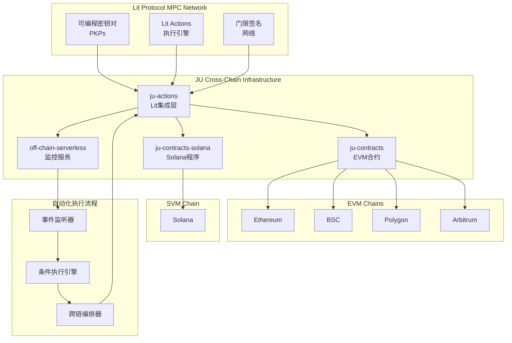
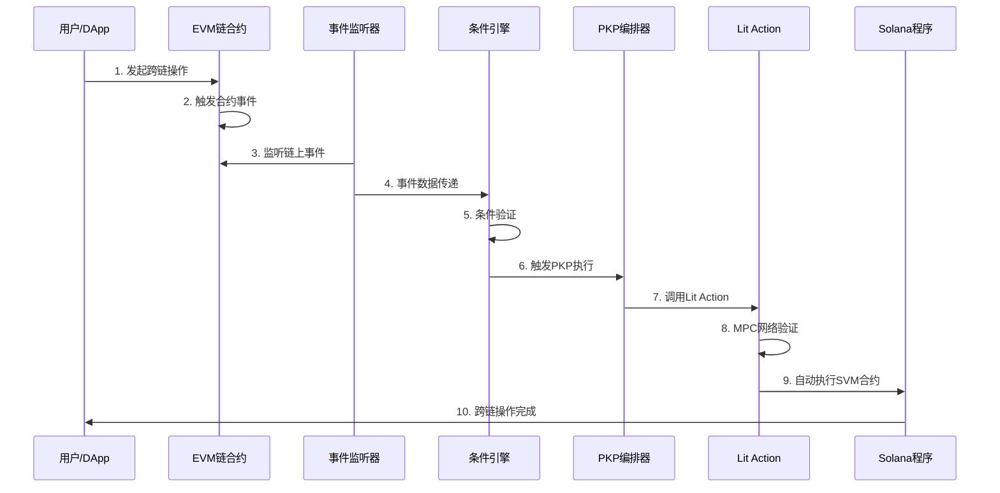

# JU MPC Cross-Chain Architecture
# Lit Protocol MPC网络 + Lit Actions 自动化跨链合约调用架构设计

## 项目概述

### 核心目标
实现基于 Lit Protocol MPC 网络的自动化跨链合约调用系统，支持：
- **EVM ↔ SVM** 跨链自动化合约调用
- **EVM ↔ EVM** 兼容链之间的跨链合约调用  
- **条件执行** 基于链上事件的智能触发机制

### 关键技术特性
- 🔐 **可编程密钥对 (PKPs)** - 去中心化密钥管理
- ⚡ **门限签名** - 多方计算安全机制
- 🎯 **条件执行** - 智能合约事件驱动的自动化
- 🌉 **跨链互操作** - 统一的多链执行环境

## 系统架构

### 整体架构图



### 数据流架构



## 核心组件设计

### 1. 增强的PKP编排器 (Enhanced PKP Orchestrator)

#### 现有基础
- `ju-actions/src/actions/auth/create-sol-orchestrator-lit.ts`
- 基础PKP创建和管理功能

#### 增强设计
```typescript
interface CrossChainPKP {
  // 现有功能扩展
  pkpId: string;
  publicKey: string;
  ethAddress: string;
  solanaAddress: string;
  
  // 新增跨链功能
  supportedChains: ChainId[];
  crossChainPermissions: CrossChainPermission[];
  conditionalExecutionRules: ConditionRule[];
  automaticSigningEnabled: boolean;
}

interface CrossChainPermission {
  sourceChain: ChainId;
  targetChain: ChainId;
  contractAddress: string;
  methodSignature: string;
  maxGasLimit: bigint;
  rateLimitPerHour: number;
}

interface ConditionRule {
  id: string;
  eventSignature: string;
  sourceContract: string;
  conditions: LogicalCondition[];
  targetAction: CrossChainAction;
  cooldownPeriod: number;
}
```

### 2. 智能条件执行引擎 (Smart Condition Engine)

#### 核心功能设计
```typescript
class SmartConditionEngine {
  // 事件监听和过滤
  async monitorChainEvents(chains: ChainId[]): Promise<void>;
  
  // 条件验证逻辑
  async evaluateConditions(
    event: ChainEvent, 
    rules: ConditionRule[]
  ): Promise<ExecutionDecision>;
  
  // 跨链执行编排
  async orchestrateCrossChainExecution(
    decision: ExecutionDecision
  ): Promise<ExecutionResult>;
  
  // 安全验证机制
  async validateExecution(
    action: CrossChainAction
  ): Promise<SecurityValidation>;
}
```

#### 条件执行流程
1. **事件捕获** - 实时监听多链合约事件
2. **条件匹配** - 根据预设规则验证触发条件
3. **安全检查** - 多层安全验证机制
4. **自动执行** - PKP驱动的跨链合约调用
5. **结果确认** - 执行状态跟踪和确认

### 3. 跨链消息协议 (Cross-Chain Messaging Protocol)

#### 消息结构设计
```typescript
interface CrossChainMessage {
  messageId: string;
  sourceChain: ChainId;
  targetChain: ChainId;
  sourceContract: string;
  targetContract: string;
  
  // 执行参数
  functionSelector: string;
  encodedParams: string;
  gasLimit: bigint;
  
  // 安全参数
  nonce: number;
  deadline: number;
  signature: string;
  
  // MPC验证
  requiredSignatures: number;
  collectedSignatures: MPCSignature[];
}

interface MPCSignature {
  nodeId: string;
  signature: string;
  timestamp: number;
}
```

## 技术实现路线

### Phase 1: 基础设施增强 (4-6周)

#### 1.1 PKP功能扩展
- [ ] 扩展现有PKP创建逻辑支持多链
- [ ] 实现跨链权限管理系统
- [ ] 添加自动签名授权机制
- [ ] 集成门限签名验证流程

#### 1.2 Lit Actions增强
- [ ] 扩展`solver-lit-impl.ts`支持跨链调用
- [ ] 实现条件执行逻辑
- [ ] 添加智能合约状态查询功能
- [ ] 集成多链RPC调用能力

#### 1.3 监控服务升级
- [ ] 扩展`keeper-service.ts`支持多链事件监听
- [ ] 实现实时事件过滤和处理
- [ ] 添加自动化触发机制
- [ ] 集成MPC网络协调功能

### Phase 2: 智能执行引擎 (6-8周)

#### 2.1 条件执行引擎开发
- [ ] 设计和实现事件监听框架
- [ ] 开发条件验证逻辑引擎
- [ ] 实现安全检查和验证机制
- [ ] 集成自动化执行编排器

#### 2.2 跨链协议实现
- [ ] 设计跨链消息协议
- [ ] 实现EVM-SVM双向通信
- [ ] 添加消息路由和转发机制
- [ ] 集成状态同步功能

#### 2.3 安全和监控
- [ ] 实现多层安全验证
- [ ] 添加执行结果验证
- [ ] 集成实时监控和告警
- [ ] 实现失败恢复机制

### Phase 3: 生产优化 (4-6周)

#### 3.1 性能优化
- [ ] 优化跨链通信延迟
- [ ] 实现智能Gas费用管理
- [ ] 添加负载均衡机制
- [ ] 优化MPC网络性能

#### 3.2 用户界面
- [ ] 开发管理界面
- [ ] 实现规则配置工具
- [ ] 添加监控仪表板
- [ ] 集成用户权限管理

#### 3.3 测试和部署
- [ ] 全面集成测试
- [ ] 安全审计和验证
- [ ] 主网部署准备
- [ ] 文档和培训材料

## 安全考虑

### 1. MPC网络安全
- **分布式信任** - 无单点故障的密钥管理
- **门限签名** - 防止单点密钥泄露
- **网络共识** - 多节点验证机制

### 2. 跨链安全
- **消息验证** - 密码学验证跨链消息
- **重放攻击防护** - Nonce和时间戳机制
- **权限控制** - 细粒度的执行权限管理

### 3. 智能合约安全
- **访问控制** - 严格的权限验证
- **参数验证** - 输入参数安全检查
- **状态一致性** - 跨链状态同步验证

## 监控和运维

### 1. 实时监控指标
- 跨链交易成功率
- MPC网络响应时间  
- 智能合约执行状态
- 系统资源使用情况

### 2. 告警机制
- 异常交易检测
- 网络连接状态监控
- 智能合约执行失败告警
- 安全事件实时通知

### 3. 日志和审计
- 完整的执行日志记录
- 跨链操作审计追踪
- 安全事件日志分析
- 性能指标历史数据

## 总结

这个架构设计充分利用现有的四个工程项目基础，通过Lit Protocol MPC网络实现真正的自动化跨链合约调用。关键创新点包括：

1. **智能条件执行** - 基于链上事件的自动化触发
2. **统一跨链接口** - EVM和SVM的无缝集成
3. **去中心化安全** - MPC网络保证的密钥安全
4. **可编程自动化** - 灵活的规则配置和执行

通过分阶段实施，我们可以逐步构建一个强大、安全、高效的跨链自动化系统。