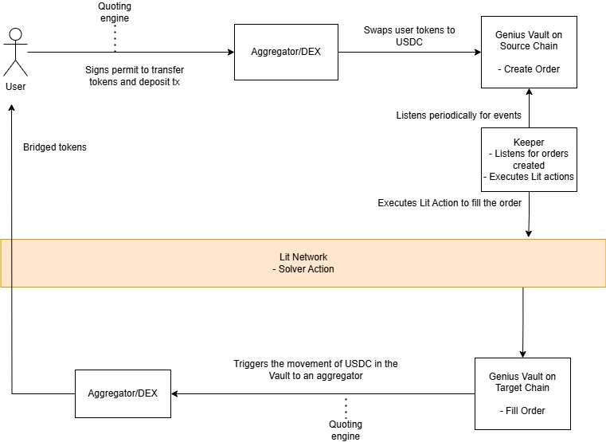
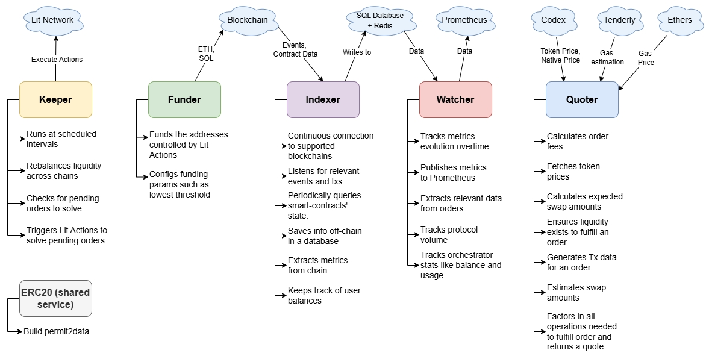

# MPC Cross-Chain Solution

**MPC e2e Lit Protocol 方案 (Relayer)**

MPC（安全多方计算）的跨链支持合约调用，主要是 EVM，后续支持 SVM。

**在一个链上执行交易，并自动触发另一个链上的**回调（\text{Callback}）**操作，以确保两条链上的状态同步或完成一笔原子操作。**

Lit Protocol 提供了一个以可编程性和通用密钥管理为核心的去中心化网络。其 MPC 网络、可编程密钥对（PKPs）和 Lit Actions 实现自动化通用的跨链合约调用。

Lit Actions 
• 作为可信的中继层relayer，通过与 \text{EVM} 链和非 \text{EVM} 链上的智能合约交互，实现复杂的跨链逻辑。

Lit Actions 可以使用**门限密码学（\text{Threshold Cryptography}）**安全地执行以下操作：

- **签署交易**：Lit Actions 可以**代表用户或 \text{dApp} 安全地生成和使用私钥片段，对交易进行签名**。这使得它们可以充当**去中心化的钱包或自动化执行代理**。
- **解密/加密内容**：Lit Actions 可以在满足特定条件（如用户持有特定的 \text{NFT}、时间到达等）时，使用私钥片段来解密或加密数据

**Lit Protocol** 提供了一个更通用的**可编程 MPC 网络**，它的重点是**密钥管理**和**自动化交易**。

- 原生支持一个以太坊钱包来与该协议交互， 签名和gas
- 使用Arbitrum Orbit 定制化的EVM rollup [Chronicle Yellowstone](https://developer.litprotocol.com/connecting-to-a-lit-network/lit-blockchains/chronicle-yellowstone) 黄石链L2 ，作为协议的链上注册表和节点协调层。 [faucet](https://chronicle-yellowstone-faucet.getlit.dev/) tstLPX token 在 rollup 支付。

**优点**：

**可编程性**：其 MPC 网络支持在签名时加入条件判断，比如**"如果预言机数据显示..."**，这为自动化和复杂的合约调用提供了独特的可能性。

**通用性**：与NEAR类似，它可以为各种链生成签名。

**面向开发者**：提供了简洁的SDK，抽象了底层复杂的MPC细节，便于应用层开发。

**缺点**：

**相对较新**：虽然技术很酷，但在跨链合约调用的实际大规模应用上，其生产环境的成熟度有待验证

**Chain Abstraction and DeFi  生态**

创建无缝的互操作性解决方案，促成跨链通信和交易执行，打造一个更加统一和高效的 Web3 生态系统。

JU is a value-capturing flywheel.

传统的bridge 是作为静默的pipeline, 而genius 作为价值捕获 flywheel, 本身就是流动性.

https://github.com/samuel-videau/genius-assignment

https://docs.bridgesmarter.com/getting-started/developer-guide

Lit actions deploy to IPFS 哈希的ACL只有授权的操作可以执行 ，一旦部署到 IPFS，Lit Actions 是不可变的，lit action 用代理模式可升级。

[https://pinata.cloud/](https://pinata.cloud/) 免费额度的ipfs 存储

On-chain contract 

[https://github.com/jong-un-1/genius-cross-chain](https://github.com/jong-un-1/genius-cross-chain)

[JU](https://www.tradegenius.com/) Bridge Protocol  (GBP)+  JU Terminal   vs Debridge

https://docs.bridgesmarter.com/

Off-chain rebalancing services 链下服务会监控余额并启动再平衡操作。利用跨链桥，如 Circle 的 CCTP 和 Wormhole，来恢复目标流动性水平并维持协议的偿付能力。

Keeper、Funder、Indexer、Watcher 和 Quoter 五个核心服务组件和多个数据源/网络组成。Off-chain 后端服务（Microservices）： 使用 Go、TypeScript/Node.js 或 Python 等语言，分别实现 Keeper、Funder、Indexer、Watcher 和 Quoter 的逻辑。

数据库和监控： 利用 PostgreSQL/MySQL (SQL Database)、Redis (缓存) 和 Prometheus (时序数据库) 来存储、查询和监控数据。

系统组件及其职能

1. Keeper (守护者)
- 角色： 负责按计划和条件执行操作，维护系统流动性和订单状态。
- 主要功能：
    - 定期运行。
    - 在不同链之间重新平衡流动性（Rebalances liquidity across chains）。
    - 检查是否有待处理的订单需要解决（solve pending orders）。
    - 触发 Lit Actions 来解决这些待处理的订单。
- 数据源/目标： Lit Network（执行操作）。
1. Funder (资金提供者)
- 角色： 负责为受控地址提供资金，确保有足够的燃料费或抵押品来执行操作。
- 主要功能：
    - 为由 Lit Actions 控制的地址提供资金。
    - 配置资金参数，例如最低阈值。
- 数据源/目标： Blockchain（区块链），涉及 ETH, SOL（以太坊、Solana，表明这是一个多链系统）。
1. Indexer (索引器)
- 角色： 负责监听区块链事件，提取数据，并将其存储在链下数据库中。
- 主要功能：
    - 与支持的区块链保持持续连接。
    - 监听相关的事件和交易（txs）。
    - 定期查询智能合约的状态。
    - 将信息存储在链下数据库中。
    - 从链上提取指标。
    - 跟踪用户余额。
- 数据源/目标： Blockchain（事件、合约数据），写入 SQL Database + Redis。
1. Watcher (观察者)
- 角色： 负责跟踪和监控系统指标、协议使用量和性能，并将数据发布到监控系统。
- 主要功能：
    - 跟踪指标随时间的变化。
    - 从订单中提取相关数据。
    - 跟踪协议交易量（protocol volume）。
    - 跟踪协调器（orchestrator）的统计数据，如余额和使用情况。
    - 将指标发布到 Prometheus。
- 数据源/目标： 从 SQL Database + Redis 读取数据，并写入 Prometheus。
1. Quoter (报价器)
- 角色： 负责计算执行一个订单或交易（swap）所需的所有参数和费用，并返回最终报价。
- 主要功能：
    - 计算订单费用。
    - 获取代币价格。
    - 计算预期的兑换（swap）数量。
    - 确保存在足够的流动性来完成订单。
    - 为订单生成交易（Tx）数据。
    - 将完成订单所需的所有操作考虑在内，并返回一个报价。
- 数据源/目标： Codex（代币和原生价格），Tenderly（Gas 估算），Ethers（Gas 价格）。
共享服务
1. ERC20 (shared service)： 构建 permit2data。这是一种代币授权标准，通常用于提高交易效率和安全性。

将执行逻辑嵌入 Lit 协议的去中心化 MPC 网络，GBP 在不依赖于许可的solver情况下保持完全的确定性和去中心化。执行是基于区块链事件触发的，并由 Lit 节点使用阈值签名tss 指令进行。保险库余额会不断监控，并在需要时触发再平衡操作——确保协议保持偿付能力、资本高效且与链无关。

**1. 核心基础设施层：Lit Protocol 网络与 Chronicle YellowStone L2**

这是整个解决方案的基石，由两个核心部分组成：

- **Lit node网络：** 一个去中心化的 MPC 网络，由多个独立节点组成。这些节点共同管理密钥分片，可以合作生成签名而无需暴露完整的私钥。这是安全性的基础。
- **可编程密钥对 (PKPs - Programmable Key Pairs)：** 一个 PKP 是一个由 Lit 网络控制的区块链账户（钱包）。它的私钥被分片并由所有节点共同管理。你可以把它看作是一个由去中心化云服务控制的钱包。
- **多签名算法支持：** Lit Protocol 的设计是链无关的，原生支持多种签名算法，包括 EVM 链所需的 ECDSA 和 Solana (SVM) 所需的 Ed25519。这保证了它可以为几乎任何主流公链生成有效签名。
- **Chronicle 协调层：** Lit Protocol 使用一个定制化的 EVM rollup L2 链（名为 Chronicle Yellowstone）作为其协调和注册层。所有 PKP 的铸造、权限管理（例如，授权哪个 Lit Action 可以使用哪个 PKP）都在这条链上完成。这就像是 Lit 网络的“控制面板”。

**2. 跨链通信与执行层：Lit Actions 与 Relayer**

这一层负责在不同区块链之间传递信息、验证状态、触发操作并最终确保交易上链，是整个自动化流程的“大脑”和“手臂”。

- Lit Actions (大脑 - 逻辑与签名中心):
这是一段在 Lit 节点网络上运行的 JavaScript 代码，是去中心化的决策核心。Lit Actions 可以：
    - **读取链上状态：** 从任何链（如以太坊、Solana）的 RPC 端点读取数据。
    - **调用外部 API：** 获取预言机数据、天气信息或任何 Web2 数据。
    - **执行任意逻辑：** 根据读取到的数据执行条件判断（例如，“如果 A 链上的某地址余额大于 100 ETH，则…”）。
    - **请求签名：** 如果逻辑条件满足，Lit Action 可以请求 Lit 网络使用其管理的 PKP 为一笔交易签名。
- Relayer (手臂 - 交易广播与执行中心):
Lit Protocol 刻意将 签名生成 与 交易广播 这两个环节解耦。Lit 负责前者，而 Relayer 负责后者。这种“关注点分离”的设计带来了极大的灵活性和健壮性。Relayer 是一个独立的后端服务，它负责：
    - **接收签名任务：** 从 Lit 网络或用户的应用后端获取签名后的交易。
    - **管理 Gas 与 Nonce：** 为交易支付目标链所需的 Gas 费，并正确管理交易的 Nonce（序号），确保交易能被矿工打包。
    - **广播与监控：** 将签名交易广播到目标链（如以太坊或 Solana）的节点，并监控其执行状态，在必要时进行重试或提高 Gas。
- **实现模式：**
    - **自建 Relayer：** 开发者可以自己运行一个简单的云服务来完成广播，拥有完全控制权，适合开发和测试阶段。
    - **第三方 Relayer 网络：** 对于生产环境，强烈推荐使用如 **Gelato Network** 或 **OpenZeppelin Defender** 等专业的自动化网络。它们提供了高可用性、去中心化的中继服务，并解决了 Gas 费和 Nonce 管理的复杂性。
- **资产管理：** Lit Protocol 本身不直接管理资产，它提供的是安全签名能力。开发者可以使用此架构构建自己的跨链资产管理合约（金库 Vaults），将其所有权设置为一个 PKP 地址。这样，只有当满足 Lit Action 中定义的条件并由 Relayer 成功广播后，资产才能被动用。

**3. 应用与服务层：Lit SDK 与用户界面**

这一层是开发者和用户与 Lit 跨链服务交互的接口。

- **统一 API/SDK：** Lit Protocol 提供了简洁易用的 JavaScript/TypeScript SDK，开发者可以：
    - 连接到 Lit 网络。
    - 上传并注册 Lit Actions。
    - 请求执行 Lit Actions 并获取签名结果，然后 **递交给 Relayer**。
- **参数解析与交易构建：** 交易数据的构建通常发生在 Lit Action 内部。
    - **对于 EVM：** 使用 ethers.js 或 viem.sh 等库在 Lit Action 内部进行 ABI 编码。
    - **对于 SVM：** 使用 @solana/web3.js 等库在 Lit Action 内部构建指令和交易。
- **完整的交易签名与广播流程：**
    - 用户的应用触发一个 Lit Action。
    - Lit 节点网络执行该 Action。
    - Action 内部构建好原始交易后，调用 Lit.Actions.signEcdsa() 或其他签名函数。
    - Lit 节点合作生成签名，并将其返回给 Action。
    - Action 将签名后的交易数据返回给外部调用者。
    - **Relayer 接手：** 外部调用者（通常是一个监控服务）将此签名数据传递给 **Relayer**。
    - **Relayer** 负责支付 Gas、管理 Nonce，并将这笔已签名的交易广播至目标链。

**4. 解决方案工作流示例（EVM → Solana）**

假设用户希望在 EVM 链（如 Arbitrum）上锁定 100 USDC，然后在 Solana 链上获得 100 wUSDC。

1. **用户发起请求：** 用户与应用前端交互，批准 Arbitrum 上的 USDC 并调用一个由 PKP 控制的金库合约的 lock 函数。
2. **源链操作：** 用户的 100 USDC 被锁定在 Arbitrum 的金库合约中。该合约发出一个 AssetLocked 事件。
3. **Lit Action 触发与执行：** 一个外部监控服务（可以是 Gelato Network，也可以是开发者自己运行的简单脚本）监听到 AssetLocked 事件后，调用 Lit Protocol 网络执行一个预先注册好的 Lit Action。
4. **MPC 签名生成（核心步骤）：**
    - Lit 节点网络并发执行该 Lit Action。
    - Action 代码通过访问 Arbitrum 的 RPC 节点，验证 AssetLocked 事件的真实性和最终性。
    - 验证通过后，Action 代码使用 Solana 的库构建一笔交易，该交易的指令是：在 Solana 上向用户的地址铸造 100 wUSDC。
    - Action 代码调用 Lit.Actions.sign() 请求网络使用 Ed25519 算法为这笔 Solana 交易签名。
5. **目标链执行 (Relayer 关键作用):**
    - Lit Action 将签名后的 Solana 交易返回给监控服务。
    - 该监控服务现在 **扮演 Relayer 的角色** (或者将任务委托给一个专业的 Relayer 网络)。
    - **Relayer** 负责为这笔 Solana 交易支付 SOL 作为 Gas 费，并将其广播到 Solana 网络。
6. **交易完成：** Solana 网络执行交易，用户的 Solana 钱包收到了 100 wUSDC。整个跨链流程自动化、去中心化地完成。

**核心考量要素**

- **安全性与信任模型：** 安全性依赖于 Lit 节点的去中心化程度和诚实节点假设。信任模型是去中心化的，但新增了对 **Relayer** 的信任（主要关于 **活性 Liveness**，即 Relayer 是否会及时广播交易，而不是资产安全）。使用去中心化 Relayer 网络可以减轻此问题。
- **通用性与可扩展性：** 极高。Lit Actions 是图灵完备的 JavaScript，可以实现任意复杂的逻辑。支持多种签名算法使其能轻松扩展到任何新链。
- **开发体验与文档：** 优秀。Lit Protocol 非常注重开发者体验，其 SDK 和文档清晰易懂，抽象了底层的 MPC 复杂性。
- **运维复杂性与 Relayer 策略：** 这是一个关键考量。自建 Relayer 引入了额外的运维工作，包括服务器维护、私钥管理、Gas 资金补充和 Nonce 管理。**采用第三方 Relayer 服务是生产环境的最佳实践**。
- **成本与效率：**
    - **成本：** 包括在 Chronicle L2 上支付的 Gas 费、**Relayer 支付的目标链 Gas 费**，以及可能的 **Relayer 服务费**。
    - **效率（延迟）：** 取决于 Lit 网络的共识速度、Lit Action 的执行复杂度以及 **Relayer 广播交易的策略和目标链的网络拥堵状况**。

**总结与行动建议**

对于需要支持 EVM 和 SVM 的跨链合约调用，特别是那些需要自动化和复杂条件逻辑的场景，Lit Protocol 提供了一个无与伦比的、灵活且开发者友好的解决方案。

- **如果你需要的不只是签名，而是“有条件的签名”：** 例如“当 Oracle 价格高于 X 时才执行交易”，或者“当 DAO 投票通过后才释放资金”，那么 Lit Protocol 是最佳选择。
- **与 NEAR MPC 的对比：**
    - NEAR MPC 更像一个纯粹、强大的去中心化签名后端，与 NEAR 生态结合紧密。
    - Lit Protocol 则更像一个去中心化的 **自动化网络**，它的核心是 Lit Actions 带来的可编程性。
- **行动建议：** 选择 Lit Protocol 意味着你将获得一个强大的自动化引擎。但至关重要的是，你必须 **制定一个明确的 Relayer 策略**。建议在开发阶段使用自建 Relayer 以便快速迭代，**在上线生产环境时，强烈建议集成如 Gelato 等成熟的第三方 Relayer 网络**，以确保业务的高可用性和稳定性。

Chronicle Yellowstone 协调、铸造 PKP（可编程密钥对）以及管理 PKP 权限，

铸造 pkp 时，您钱包中必须有 **tstLPX** 测试代币支付gas， faucet **黄石公园。**

| **Parameter Name  参数名称** | **Value  价值** |
| --- | --- |
| Chain ID  链 ID | 175188 |
| Name  名称 | Chronicle Yellowstone - Lit Protocol Testnet |
| RPC URL | [**](https://yellowstone-rpc.litprotocol.com/)[https://yellowstone-rpc.litprotocol.com/**](https://yellowstone-rpc.litprotocol.com/**) |
| Block Explorer URL  区块浏览器 URL | [**](https://yellowstone-explorer.litprotocol.com/)[https://yellowstone-explorer.litprotocol.com/**](https://yellowstone-explorer.litprotocol.com/**) |
| Currency Symbol  货币符号 | tstLPX |
| Currency Decimals  货币小数位 | 18 |

**参考链接**

- **官方开发者文档**: [https://developer.litprotocol.com/](https://developer.litprotocol.com/)
- **Lit Protocol 节点架构与安全**: [https://developer.litprotocol.com/security/node-architecture](https://developer.litprotocol.com/security/node-architecture)
- **生态系统项目（用例）**: [https://developer.litprotocol.com/Ecosystem/projects](https://developer.litprotocol.com/Ecosystem/projects)
- **Chronicle Yellowstone 测试网信息**:
    - **RPC URL**: https://yellowstone-rpc.litprotocol.com/
    - **Explorer**: https://yellowstone-explorer.litprotocol.com/
    - **Faucet (水龙头)**: https://chronicle-yellowstone-faucet.getlit.dev/