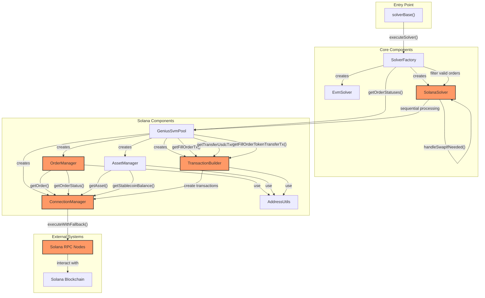

```mermaid
flowchart TD
    subgraph "Entry Point"
        solverBase["solverBase()"]
    end

    subgraph "Core Components"
        SolverFactory["SolverFactory"]
        EvmSolver["EvmSolver"]
        SolanaSolver["SolanaSolver"]
    end

    subgraph "Solana Components"
        GeniusSvmPool["GeniusSvmPool"]
        ConnectionManager["ConnectionManager"]
        OrderManager["OrderManager"]
        AssetManager["AssetManager"]
        TransactionBuilder["TransactionBuilder"]
        AddressUtils["AddressUtils"]
    end

    subgraph "External Systems"
        SolanaRPC["Solana RPC Nodes"]
        Blockchain["Solana Blockchain"]
    end

    solverBase -->|"executeSolver()"| SolverFactory
    SolverFactory -->|"creates"| SolanaSolver
    SolverFactory -->|"creates"| EvmSolver
    SolverFactory -->|"getOrderStatuses()"| GeniusSvmPool
    SolverFactory -->|"filter valid orders"| SolanaSolver

    SolanaSolver -->|"fillOrderBatch()"| SolanaSolver
    SolanaSolver -->|"verifyOrderParams()"| SolanaSolver
    SolanaSolver -->|"fillOrderSvm()"| SolanaSolver

    SolanaSolver -->|"sequential processing"| GeniusSvmPool

    GeniusSvmPool -->|"creates"| ConnectionManager
    GeniusSvmPool -->|"creates"| OrderManager
    GeniusSvmPool -->|"creates"| AssetManager
    GeniusSvmPool -->|"creates"| TransactionBuilder

    GeniusSvmPool -->|"getFillOrderTx()"| TransactionBuilder
    GeniusSvmPool -->|"getTransferUsdcTxn()"| TransactionBuilder
    GeniusSvmPool -->|"getFillOrderTokenTransferTx()"| TransactionBuilder

    SolanaSolver -->|"getSolanaSwapTx()"| SolanaSolver
    SolanaSolver -->|"handleSwapIfNeeded()"| SolanaSolver

    ConnectionManager -->|"executeWithFallback()"| SolanaRPC
    OrderManager -->|"getOrder()"| ConnectionManager
    OrderManager -->|"getOrderStatus()"| ConnectionManager
    AssetManager -->|"getAsset()"| ConnectionManager
    AssetManager -->|"getStablecoinBalance()"| ConnectionManager
    TransactionBuilder -->|"create transactions"| ConnectionManager

    SolanaRPC -->|"interact with"| Blockchain

    OrderManager -->|"use"| AddressUtils
    AssetManager -->|"use"| AddressUtils
    TransactionBuilder -->|"use"| AddressUtils

    class SolanaSolver,ConnectionManager,OrderManager highlight
    class TransactionBuilder,SolanaRPC highlight

    classDef highlight fill:#f96,stroke:#333,stroke-width:2px;
```
