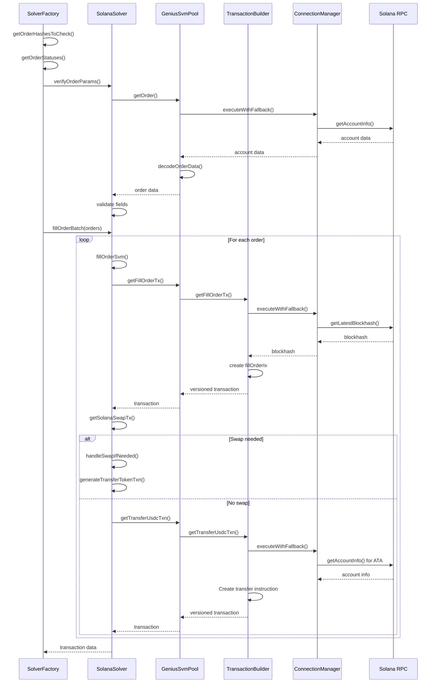

```mermaid
sequenceDiagram
    participant Solver as SolverFactory
    participant SolanaSolver
    participant SvmPool as GeniusSvmPool
    participant TxBuilder as TransactionBuilder
    participant ConnMgr as ConnectionManager
    participant RPC as Solana RPC

    Solver->>Solver: getOrderHashesToCheck()
    Solver->>Solver: getOrderStatuses()
    Solver->>SolanaSolver: verifyOrderParams()
    SolanaSolver->>SvmPool: getOrder()
    SvmPool->>ConnMgr: executeWithFallback()
    ConnMgr->>RPC: getAccountInfo()
    RPC-->>ConnMgr: account data
    ConnMgr-->>SvmPool: account data
    SvmPool->>SvmPool: decodeOrderData()
    SvmPool-->>SolanaSolver: order data
    SolanaSolver->>SolanaSolver: validate fields

    Solver->>SolanaSolver: fillOrderBatch(orders)

    loop For each order
        SolanaSolver->>SolanaSolver: fillOrderSvm()
        SolanaSolver->>SvmPool: getFillOrderTx()
        SvmPool->>TxBuilder: getFillOrderTx()
        TxBuilder->>ConnMgr: executeWithFallback()
        ConnMgr->>RPC: getLatestBlockhash()
        RPC-->>ConnMgr: blockhash
        ConnMgr-->>TxBuilder: blockhash
        TxBuilder->>TxBuilder: create fillOrderIx
        TxBuilder-->>SvmPool: versioned transaction
        SvmPool-->>SolanaSolver: transaction

        SolanaSolver->>SolanaSolver: getSolanaSwapTx()

        alt Swap needed
            SolanaSolver->>SolanaSolver: handleSwapIfNeeded()
            SolanaSolver->>SolanaSolver: generateTransferTokenTxn()
        else No swap
            SolanaSolver->>SvmPool: getTransferUsdcTxn()
            SvmPool->>TxBuilder: getTransferUsdcTxn()
            TxBuilder->>ConnMgr: executeWithFallback()
            ConnMgr->>RPC: getAccountInfo() for ATA
            RPC-->>ConnMgr: account info
            TxBuilder->>TxBuilder: Create transfer instruction
            TxBuilder-->>SvmPool: versioned transaction
            SvmPool-->>SolanaSolver: transaction
        end
    end

    SolanaSolver-->>Solver: transaction data
```
