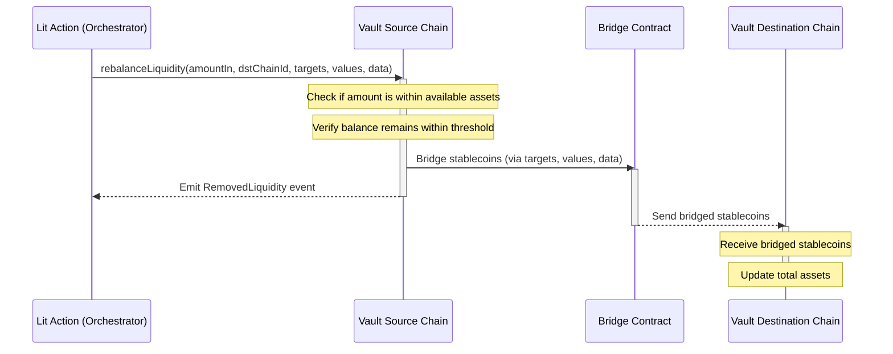

```mermaid
sequenceDiagram
    participant Orchestrator as Lit Action (Orchestrator)
    participant Vault_Source as Vault Source Chain
    participant Bridge as Bridge Contract
    participant Vault_Dest as Vault Destination Chain

    Orchestrator->>Vault_Source: rebalanceLiquidity(amountIn, dstChainId, targets, values, data)
    activate Vault_Source
    Note over Vault_Source: Check if amount is within available assets
    Note over Vault_Source: Verify balance remains within threshold
    Vault_Source->>Bridge: Bridge stablecoins (via targets, values, data)
    activate Bridge
    Vault_Source-->>Orchestrator: Emit RemovedLiquidity event
    deactivate Vault_Source

    Bridge-->>Vault_Dest: Send bridged stablecoins
    deactivate Bridge
    activate Vault_Dest
    Note over Vault_Dest: Receive bridged stablecoins
    Note over Vault_Dest: Update total assets
    deactivate Vault_Dest
```